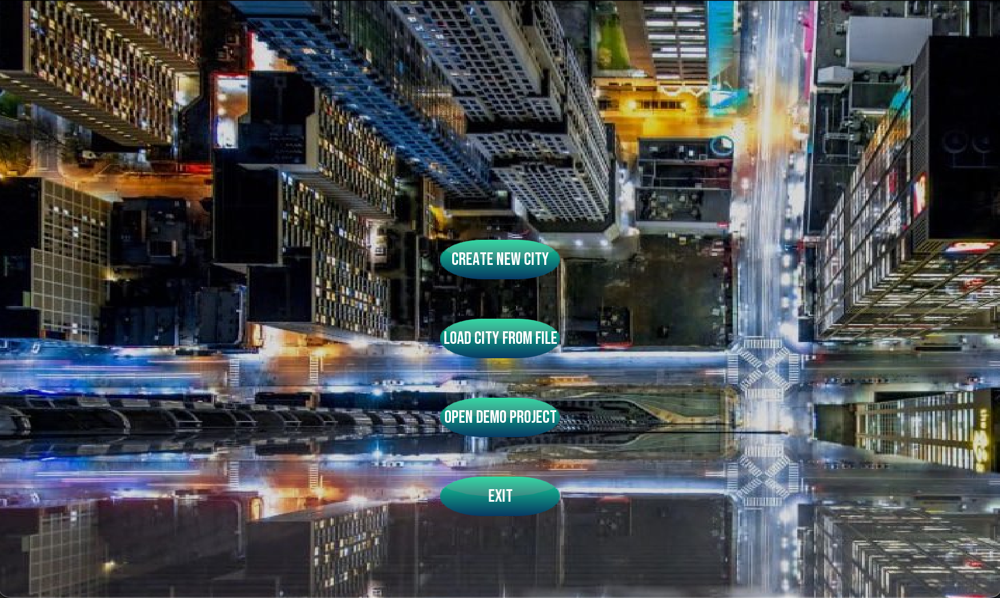
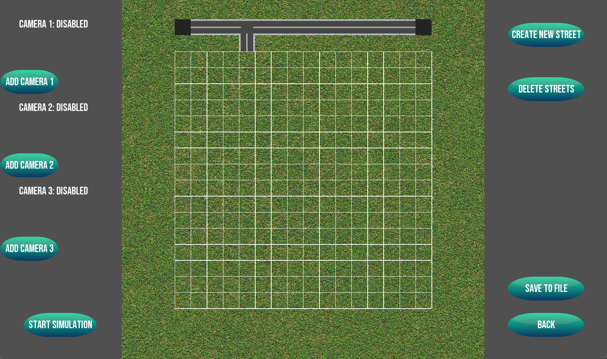
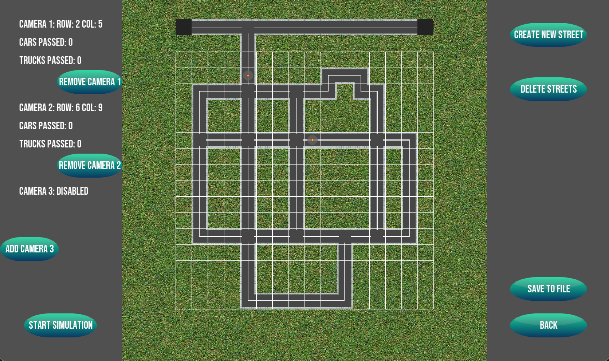
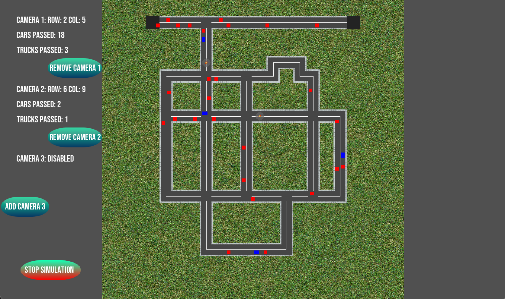
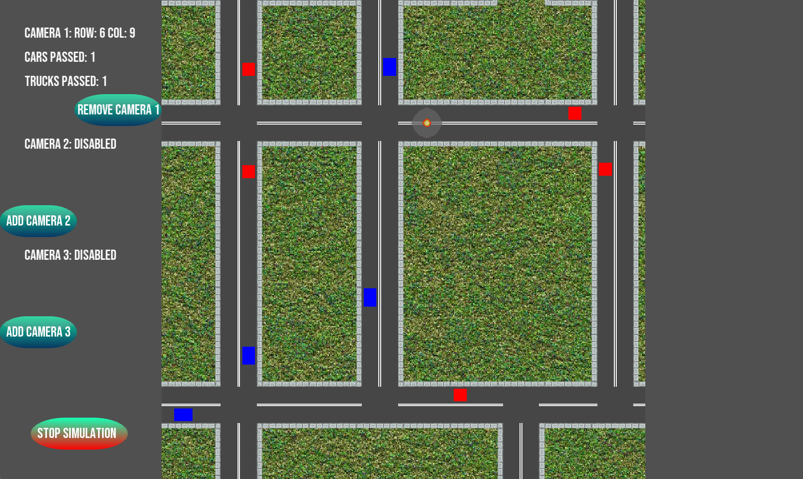
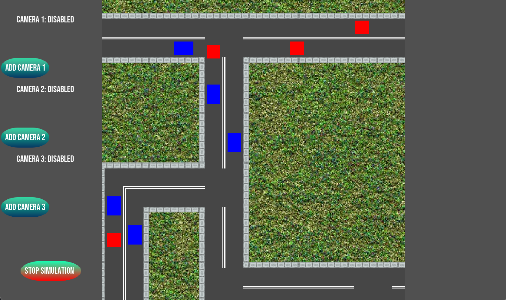
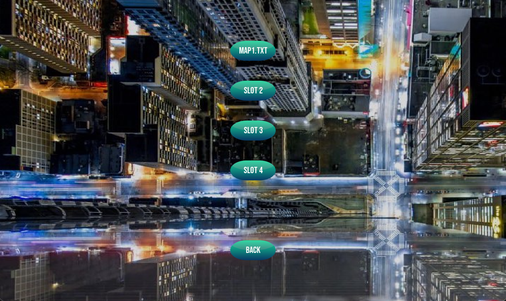

# City Traffic Simulator
> Application allowing to build roads and simulate traffic on them. 

## Table of contents
* [General info](#general-info)
* [Screenshots](#screenshots)
* [Setup](#setup)
* [Technologies](#technologies)
* [Instruction](#instruction)
* [Tests](#tests)
* [Graphics](#graphics)
* [Contact](#contact)

## General info
City traffic simulator implemented by me and my friend [@Jan Szewczyński](https://github.com/lulek1410) for a university subject. 
App allows to create and delete streets, add and delete cameras and simply to simulate traffic on builded streets. 
Crossings and turns texture are checked and added/changed by the app, so user doesn't have to think about them. 
User can choose one demo project or load previously saved projects from the disk. 
Data is written to txt file. 
This application is not perfect, yet is very big, and a lot of features can be added. 
When we were starting writing the code, we didn't think how big will it be. 

## Screenshots

## Setup
In order to make it work you need:
* C++17 Compiler
* SFML Library (You can download it from here: https://www.sfml-dev.org/download.php)
* CMake (You can download it from here: https://cmake.org/download/)

In order to make the tests work you also need BoostTest (You can download it from here: https://www.boost.org/users/download/)

If you have downloaded/installed all the things above on macOS or Linux you have to open terminal in the base folder of downloaded repo. 
Then, to run the application, type into terminal following commands: 
`cmake .`
`make`
`./CityTrafficSimulator`
And the app should start. 

If you want to run tests, type into terminal following commands: 
`cmake BUILD_TESTS=ON .`
`make`
`./CityTrafficSimulatorTests`

## Technologies
* C++17
* SFML
* BoostTest

## Instruction

## Tests

## Graphics
All the street graphics and buttons graphics was made by [@Jan](https://github.com/lulek1410). Excellent work!

## Status
Project is: _finished_

## Contact
Created by [@Eryk Mroczko](https://www.erykmroczko.pl/) and [@Jan Szewczyński](https://github.com/lulek1410).
Feel free to contact us!

## License
We don't have any rights to the background picture in the main menu of application :)

